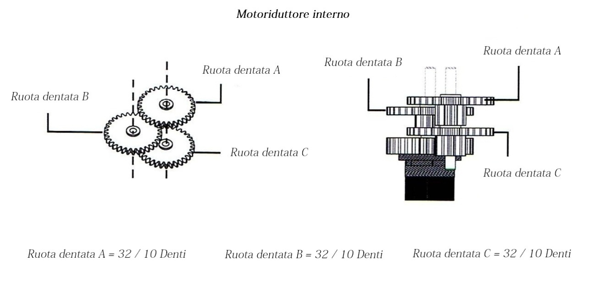
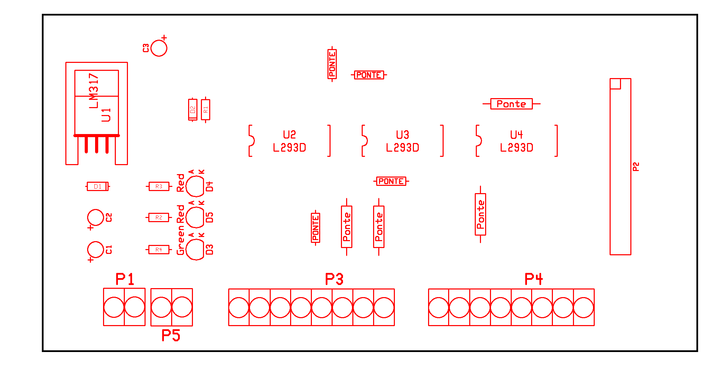
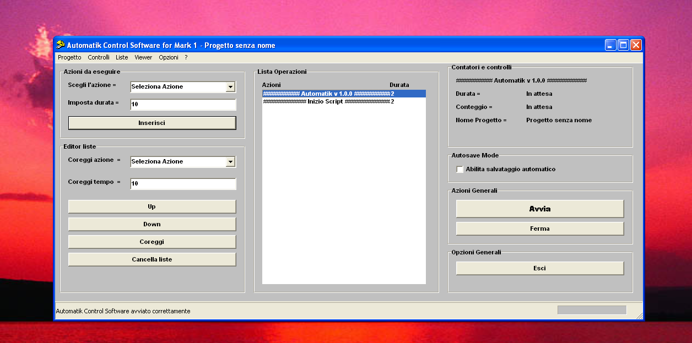

# Automated Robotic Arm Through The Use Of The Computer
**ITIS Faenza - Electronics and Telecommunications Section**

**Introduzione**

Lo sviluppo industriale e la nascita di nuove tecnologie ha permesso la creazione di prodotti sempre più complessi e complicati dal punto di vista Tecnico-Scientifico .

Le moderne industrie fanno ampio uso di sistemi automatizzati e di controlli informatici per il monitoraggio della catena di produzione industriale.

Sempre più industrie si sono mano a mano evolute dal punto di vista dell'automazione, basti pensare alle moderne industrie che lavorano in ambito automobilistico.

Rientra in questo campo , l'utilizzo di bracci robotici atti alla semplificazioni  di operazioni ripetitive e a volte pericolose e complesse.

L'utilizzo di questi macchinari ha permesso la velocizzazione della produzione e del collaudo di tutti quei prodotti che prima venivano lavorati singolarmente dalla mano umana.

Il Braccio robotico trattato in questo progetto , ovviamente , è di dimensioni e di prestazioni nettamente inferiori a quelli utilizzati in ambito industriale ma rappresenta tuttavia una federe simulazione di ciò che avviene nella pratica.

Il progetto consta di tre schede elettroniche lavoranti in simbiosi e di un braccio robotico di dimensioni ridotte.

Il progetto è costituito da varie fasi di analisi , gestione e controllo che sfruttano la capacita del computer di lavorare simultaneamente su più processi.

I dati vengono inviati dal Computer attraverso la trasmissione seriale all'interfaccia USB , che offre 8 canali di input digitali e 8 canali di output digitali.

L'interfaccia è a sua volta connessa ad una scheda di controllo e gestione dei servomotori posti nei vari giunti del braccio robotico.

I dati sfruttano la logica di tipo TTL ( +5 V ) poiché il microcontrollore presente sull'interfaccia USB e i driver per la gestione dei servomotori sono ti tipo TTL.

Attraverso vari attuatori posti sul braccio , si rilevano gli stati e le posizioni di riposo dei servomotori che vengono rilevati e inviati istantaneamente al software di controllo.

Il sistema è pienamente controllabile attraverso il Computer e i tutti i programmi presenti nel braccio sono stati creati utilizzando il linguaggio di programmazione C++.

Il braccio è comunque programmabile utilizzando anche altri linguaggi di programmazione ma si è ritenuto il C++ come il miglior compromesso in termini di prestazioni , affidabilità e comprensione .

Attraverso il C++ si è quindi creato il software per la gestione manuale e automatizzata del braccio .

Tale software rappresenta il miglior sistema per poter gestire in maniera ottimale , sicura e efficiente il braccio robotico.

Le linee di ingresso sono state utilizzare per controllare lo stato del braccio e per permetterne una più accurata gestione senza incorrere in problemi di natura tecnica quali per esempio , la torsione eccessiva di uno dei vari servomotori presenti.

`	`Il presente lavoro è cosi organizzato :

\- Il capitolo 2 analizza il progetto in modo specifico , studiando in maniera analitica e specifica il circuito elettronico di ogni scheda elettronica .

\- Il capitolo 3 analizza il progetto dal punto di vista software , focalizzandosi sul linguaggio di programmazione C++ e il modo con cui il progetto interagisce con il computer .

\- Il capitolo 4 analizza la realizzazione pratica del progetto , indicando in ogni sua minima parte le tecniche e i modi con cui è stato realizzato il braccio robotico e le relative schede elettroniche .

Sono presenti alcune appendici con le istruzioni per l'utilizzo dei software di gestione del braccio , sia per la versione automatica sia per la versione manuale.

Infine la tesi allega un CD-ROM contenente i sue software sopra citati , il presente testo in versione digitale e il listato dei codici in C++.

**CAP. 2**

**Caratteristiche Globali del progetto**

**2.1	Caratteristiche del progetto**

Il progetto è suddiviso in blocchi logici connessi tra di loro mediante BUS cavi che ne permettono una facile integrazione .

L'Elaboratore centrale , generalmente un personal computer , invia e riceve segnali elettrici attraverso la porta di comunicazione USB.

Tale porta , sfruttando un protocollo di trasmissione a pacchetti asimmetrico permette di inviare e ricevere dati digitali ad una velocità molto elevata .

L'Elaboratore centrale è quindi , connesso attraverso cavo USB all'Interfaccia USB che ne riceve i dati sottoforma di pacchetti e li smista alle 8 uscite presenti sul modulo.

L'Interfaccia è cosi connessa , attraverso un BUS dati di 8 + 8 canali , alla scheda di controllo generale , che rigenera elettricamente i segnali digitali e li elabora per poter controllare e gestire al meglio i servomotori.

Ovviamente sulla scheda di controllo sono presenti anche una serie di 8 connettori che permettono la ricezione di segnali digitali a 5 V .

*Fig . 1.0 - Diagramma a blocchi del progetto*

Tali segnali in ingresso , sono instradati dalla scheda di controllo verso l'interfaccia USB , che provvederà ad inviarli all'Elaboratore Centrale.

Nell'Interfaccia USB , le uscite e le entrate lavorano in logica TTL ( +5 V ) e ogni riferimento è sempre rivolto a massa.

La tensione fornita dall'Interfaccia USB è di 5 V con una corrente massima prelevabile di circa 500 mA .

Tale tensione è utilizzata per fornire i segnali logici ai sensori di fine corsa , che provvederanno a fornire un livello logico alto o basso a seconda del loro stato.

*Fig . 1.1 - Diagramma a blocchi dell'Interfaccia USB*

La bassa corrente prelevabile dalla porta USB ha reso necessario l'utilizzo di un alimentatore di tensione continua stabilizzato esterno , per poter fornire un'adeguata potenza ai servo motori.

L'Interfaccia USB sfrutta le potenzialità del PIC 18F4550-I/P sviluppato dalla Microchip per essere utilizzato con la porta di comunicazione seriale USB.

Tale chip poiché non necessita di elevati livelli di corrente è alimentato direttamente dalla porta di comunicazione seriale USB .

La scheda di controllo utilizzata , sfrutta la presenza di tre circuiti integrati siglati L293D che , ricevendo in ingresso 4 bit , commutano le loro uscite attraverso quattro ponti di tipo H .

Questa funzionalità permette di controllare lo stato e il verso di rotazione dei servomotori utilizzati nel braccio robotico.

I finecorsa infine , costituiti da comuni contatti elettrici o interruttori industriali NA , forniscono un segnale di tipo alto nel momento in cui vengono sollecitati dai servomotori.

Il progetto prevede quindi la possibilità di gestire in maniera globale e completa il braccio , stabilendo la posizione che esso dovrà assumere e limitando i movimenti possibili per evitare eventuali danni al braccio stesso.

**2.2	Analisi dell'Interfaccia USB**	

L'Interfaccia USB è costituita da un Microprocessore centrale , come già accennato precedentemente , del tipo PIC18F4550-I/P sviluppato appunto dalla Microchip.

Tale Chip è stato creato per l'Interfacciamento con la porta Seriale del PC , denominata appunto Universal Serial Bus.

Il PIC in questione , utilizza la porta USB per autoalimentarsi e per comunicare in modo seriale con il PC.

Offre 8 uscite di tipo digitale e 8 ingressi di tipo digitale con riferimento a massa .

*Fig . 2.1 - Schema teorico delll'Interfaccia USB*

Le caratteristiche principali fornite dalla casa costruttrice sono le seguenti :

- Full Speed USB 2.0 (12Mbit/s) interface
- 1K byte Dual Port RAM + 1K byte GP RAM
- Full Speed Transceiver
- 16 Endpoints (IN/OUT)
- Streaming Port
- Internal Pull Up resistors (D+/D-)
- 48 MHz performance (12 MIPS)

Il dato più importante che possiamo rilevare dalle seguenti informazioni è sicuramente la possibilità di disporre di ben 16 canali di Input/Output , che nel nostro caso sono stati separati in 8 di Input e 8 di Output.

Per il controllo della scheda si è scelto di optare per l’uso della suite di programmazione quale C++.

Attraverso un limitato e ristretto set di comandi , è possibile dialogare con l’Interfaccia USB e gestire tutte le linee di ingresso e di uscita .

Sono stati create  tre grandi categorie di comandi , tutte quante adibite al settaggio o alla rilevazione dei dati del’Interfaccia USB

Tali comandi si dividono come segue :

- Comandi riguardanti la connessione / gestione dell’Interfaccia 
- Comandi riguardanti le uscite
- Comandi riguardanti gli ingressi

Ogni comando fa riferimento ad un “Constructor”  che fa a sua volta riferimento a due file , forniti con l’Interfaccia .

Il “Constructor” ha la funzione di collegare tali file al programma e permettere quindi di attribuire ad una determinata parola , i codici per la connessione , rilevazione e settaggio delle uscite / ingressi.

La dichiarazione del “Constructor” rende a sua volta necessario verificare se la Scheda di Interfaccia USB è connessa o meno all’Elaboratore.

Per effettuare questo controllo , si utilizza una particolare stringa che verifica , attraverso l’invio di un pacchetto di bit , l’esistenza o meno dell’Interfaccia USB e se essa è disponibile o meno per la ricezione o invio di dati .

Come è possibile rilevare dalla matrice di codice in figura 2.2 , è possibile verificare o meno la presenza del’Interfaccia USB e di conseguenza eseguire azioni prefissate per tale evento .

Tali azioni possono essere , per esempio , ne caso in cui l’Interfaccia sia connessa al Computer , il reset di tutte le porte di uscita , utile nel caso in cui si siano verificati problemi di comunicazioni nella precedente sessione di programma.

Nel qual caso in cui la scheda non sia connessa al Computer , è possibile far terminare il programma , riportando un messaggio di errore che avvisa l’Utente della mancata connessione di tale dispositivo.

I principali comandi utilizzati in C++ per il controllo delle uscite/ingressi  sono :

- **Fotone\* object = new Fotone();** - Constructor , crea l’oggetto Fotone e abbina alla parola “object” tutte le operazioni possibili da eseguire sulla scheda .
- **object->Connect(); -** Prova a connettersi alla scheda USB , e riporta come valore logico “0” se il tentativo è fallito , come valore “1” se il tentativo è andato buon fine. 
- **object->InputReadAll();** - Legge tutti gli 8 ingressi digitali e riporta una stringa di 2^8 bit secondo quale entrata è stata connessa a +5 V. 
- **object->OutputWriteAll(variabile numerica);** - Setta tutte le 8 uscite a livello logico alto ( +5 V )  se lla variabile numerica è posta ad "1" , se invece la variabile numerica è posta a "0 " setta tutte le 8 uscite a livello logico basso +0 V.
- **object->InputRead(numero ingresso);** - Riporta in forma binaria il valore di un determinato ingresso specificato nel "numero ingresso".
- **object->OutputSet(numero uscita);** - Pone a livello logico altro o basso una delle 8 uscite presenti sull'Interfaccia . 
- **object->OutputReset(numero uscita);** - Azione inversa della precedente , setta l'uscita specificata a livello basso.

*//---------------------------------------------------------------------------*

*#include <vcl.h>*

***#include <fotone.h>***

*//---------------------------------------------------------------------------*

*#pragma package(smart\_init)*

*#pragma resource "\*.dfm"*

*THome \*Home;*

*Fotone\* object = new Fotone();*

*//---------------------------------------------------------------------------*

*\_\_fastcall THome::THome(TComponent\* Owner)*

*: TForm(Owner)*

*{*

`	`***if ( object->Connect())**// Controlla se la scheda USB è conessa*

*{*

*// Scheda USB conessa e pronta per ricevere dati*

*object->OutputWriteAll(0); // Resetta tutte le uscite della Scheda USB* 

*}*

`	`*else*

*{*

*// Scheda USB non conessa , chiude l’applicazione*

*Close();*

*}*

*}*

*//---------------------------------------------------------------------------*

*Fig. 2.2 Esempio di codice per il rilevamento dell’Interfaccia USB*

Ogni comando fa sempre riferimento al Contructor ed è possibilie inserire una sola volta ed un solo Contructor all'interno di un programma , anche se diviso in più Form.

Ogni qual volta viene eseguita un operazione di settaggio a livello altro , si forma un fronte di salita nell'uscita definita nel comando di ampiezza +5 V.

Nel qual caso , invece , venga eseguita un operazione di settaggio a livello basso , si forma un fronte di discesa nell'uscita definita nel comando di ampiezza +0 V.

Le Uscite della scheda sono state collegare alla scheda di controllo , analizzata nel paragrafo successivo , secondo questo ordine :

`	`

*Fig. 2.3 Schema di connessione dei bit di uscita*

I primi tre bit , sono adibiti al controllo dei tre driver presenti nella scheda di controllo , i quattro bit successivi sono adibiti alla gestione del verso di rotazione dei vari servomotori e infine , l'ultimo bit , gestisce direttamente il diodo Led presente nel braccio robotico.

*//---------------------------------------------------------------------------*

*void \_\_fastcall THome::sinistraMouseMove(TObject \*Sender,*

`      `*TShiftState Shift, int X, int Y)*

*{*

*object->OutputSet(2);*

*}*

*//---------------------------------------------------------------------------*

*Fig. 2.2 Esempio di codice per settare un'uscita logica ad un livello alto*

**2.3	Analisi della scheda di controllo**

** 

La scheda di controllo è costituita da tre circuiti integrati , un semplice alimentatore stabilizzato e un insieme di connettori che permettono la connessione con l'Interfaccia USB.

Attraverso il BUS controlli è inviato un segnale alto per uno dei tre Driver , il relativo Driver si abilita e permette di controllare uno dei due (o entrambi) i servomotori a esso connessi .

Inviando , invece , 4 bit attraverso il BUS dati si settano i versi di rotazione dei due servomotori connessi con il relativo driver.

L'ultimo bit rimasto , come mostra la figura 2.3 , è utilizzato per abilitare o disabilitare il diodo LED presente nella pinza del braccio robotico.

I bit di ingresso , invece , provengono dai vari finecorsa posizionati nelle zone più importanti del braccio e permettono di effettuare movimenti più acuirai e precisi , evitando quindi di superare le torsioni massime di ogni articolazione .

I segnali di ingresso trasportano un segnale logico di tipo alto ( +5 V ) che arriva direttamente dal braccio alla scheda di controllo fino all'Interfaccia USB per poter essere letti dall'Elaboratore.

Ogni Driver funziona con logica TTL a +5 V per la parte di gestione logica invece , la parte dedicata alla gestione dei due servomotori connessi al Driver , la tensione di alimentazione può variare dai +5 V fino ai +12 V D.C.

La corrente massima che può attraversare il circuito integrato durante l'abilitazione di un servomotore è di circa 1000mA.

Per questo motivo , l'alimentatore presente nella scheda di controllo è di tipo stabilizzato con tensione in entrata continua a +12 V e una tensione in uscita che pilota i servomotori variabile .

La tensione ottimale di lavoro per i servomotori è stata fissata a circa +4,00 V , per evitare di stressare troppo gli organi interni contenuti nel braccio .

`	`****

*Fig. 2.4 Schema di connessione dei bit in ingresso*

Come mostrato nella figura 2.4 è possibile osservare come sono stati disposti i vari bit e a quale sensore è stato assegnato il proprio bit.

Infine , il bit numero 7 è stato lasciato libero per eventuali scopi ausiliari di rilevazione dello stato di qualche altro sensore.

L'utilizzo di 3 bit di abilitazione e 4 bit dati ha permesso di gestire il senso di rotazione di ben 6 servomotori , cosa che altrimenti sarebbe stata difficile da effettuare .

Lo schema che segue mostra la logica di funzionamento della scheda di controllo.

|**Servomotore A**|**Servomotore B**|**Driver X ( Movimento Base )**|
| :-: | :-: | :-: |
|**Bit3**|**Bit4**|**Bit5**|**Bit6**|**Servomotore A**|**Servomotore B**|
|0|0|0|0|Fermo|Fermo|
|0|0|0|1|Fermo|Muovi a destra|
|0|0|1|0|Fermo|Muovi a sinistra|
|0|0|1|1|Fermo|Fermo|
|0|1|0|0|Muovi a destra|Fermo|
|0|1|0|1|Muovi a destra|Muovi a destra|
|0|1|1|0|Muovi a destra|Muovi a sinistra|
|0|1|1|1|Muovi a destra|Fermo|
|1|0|0|0|Muovi a sinistra|Fermo|
|1|0|0|1|Muovi a sinistra|Muovi a destra|
|1|0|1|0|Muovi a sinistra|Muovi a sinistra|
|1|0|1|1|Muovi a sinistra|Fermo|
|1|1|0|0|Fermo|Fermo|
|1|1|0|1|Fermo|Muovi a destra|
|1|0|1|0|Muovi a sinistra|Muovi a sinistra|
|1|0|1|1|Muovi a sinistra|Fermo|

*Fig. 2.4 Tabella di verità riguardante i bit di dati*

La tabella di verità rappresenta in modo schematico cosa succede ai servomotori quando viene inviata una stringa di 4 bit al driver di riferimento.

Ovviamente la tabella sovra riportata andrà ripetuta per tutti e tre i driver che interconnessi tra di loro permettono di gestire ogni movimento del braccio robotico.

Oltre ai tre driver per i servomotori , nella scheda è presente anche un alimentatore integrato di bassa potenza , utilizzato per comandare i servomotori garantendo una sufficiente erogazione di corrente .

Tale alimentatore è costituito da un integrato LM317 che utilizza la tensione in ingresso per fornire in uscita una tensione perfettamente stabile e soprattutto regolabile .

La regolazione di tale tensione , viene effettuata mediante un trimmer .

Tale trimmer permette di variare la tensione dei servomotori da un minimo di circa 3 Volt ad un massimo di circa 6 Volt.

Questa regolazione permette di proteggere i servomotori da brusche variazioni di corrente / tensione e di agire direttamente sulla velocità complessiva delle azioni del braccio.

L’alimentatore provvede direttamente ad alimentare i driver per i servomotori ed è dotato di un circuito integrato per la protezione dei sovraccarichi ( se la caduta massima sull’integrato supera un valore prefissato dalla casa costruttrice , l’integrato smette di funzionare ) e di un circuito di protezione per la temperatura .

Ovviamente l’intera scheda di controllo è connessa al braccio mediante un cavo di tipo flat e all’Interfaccia USB mediante un BUS di cavi che permette di ricevere e inviare i dati da e verso l’Interfaccia.

**2.4	Analisi del Braccio Robotico**

Il braccio robotico utilizzato è costruito da un'azienda americana ed è venduto al pubblico ad una cifra molto bassa.

*Fig. 2.5 Disegno tecnico del braccio robotico utilizzato nel progetto*

Il braccio era munito di telecomando , per poter essere comandato solo attraverso di esso , ma tale telecomando è stato rimosso per poter inserire la scheda di controllo e l'Interfaccia  USB.

Il Braccio si compone di 5 articolazioni e 5 relativi servomotori DC a spazzola con motoriduttore fisso con frizione anti - saltellamento . 

Ogni articolazione è connessa con la successiva mediante il servomotore che ne trasmette il proprio movimento rotatorio.

Ogni servomotore  collegato alla scheda di controllo mediante un connettore femmina .

Nella parte terminale del braccio , ove vi è la pinza , è stato inserito un diodo Led ad alta luminosità utilizzato per lavorazioni notturne .

Sono stati disposti vari sensori disposti lungo il braccio che permettono di controllare il braccio senza rischiare di danneggiare una o più parti del braccio robotico .

Oltre alla funzione di controllo della torsione massima per ogni servomotore , i sensori fungono anche da punto di partenza per ogni movimento del braccio .

I movimenti del braccio sono cinque , che permettono di effettuare tutti i movimenti principali che un braccio robotico dovrebbe realizzare .

I movimenti principali sono :

- Movimento della base a destra e a sinistra ( autolimitata a destra e a sinistra )
- Movimento della spalla in su e in giù ( autolimitata dai finecorsa )
- Movimento del gomito in su e giù ( autolimitata dai finecorsa )
- Movimento del polso in su e giù ( autolimitata dal finecorsa solo per movimenti verso il basso 
- Chiusura e apertura della pinza ( autolimitata solo nella fase di chiusura )

Ogni servomotore è connesso ad una scheda di controllo che smista i dati provenienti dai vari Driver indirizzandoli verso i vari servomotori .

Ogni servomotore , ha un angolo di rotazione limitato sia verso l'altro sia verso il basso .

Questa limitazione ha reso obbligato l'uso di vari sensori di finecorsa per impedire appunto , che i servomotori superino il grado massimo di rotazione.

*Fig. 2.6 Disegno tecnico del motore utilizzato nel progetto*

Per poter dimensionare il circuito dell'alimentatore trattato nel paragrafo precedente è necessario conoscere la potenza massima teorica che il motore può assorbile .

Ipotizzando il motore in funzione nel braccio robotico , quindi avente come carico il solo peso del braccio da spostare , senza ipotizzare nessun peso aggiuntivo , i calcoli per dimensionare l'alimentatore sono i seguenti :

Potenza  W =Coppia   Nm \*2π\*RPM60

Dai dati tecnici forniti dal produttore sappiamo che la velocità media del motore è di circa 20.000 giri/minuto quindi 20.000 RPM.

Sappiamo inoltre che la coppia che può erogare è di circa 97,34 \* 10 - 6  Kgm .

Per convertire i Kgm in Newton per metro si utilizza la formula : 

Kgm = Nm9,81

Se ne ricava che :

Nm = Kgm \* 9.81

Quindi 97,34 \* 10 - 6 Kgm corrispondono a circa 954,60 \* 10 - 6 NM .

Sostituendo i valori conosciuti con la formula indicata precedentemente otteniamo che :

1,9999 W=0.0009546 Nm \*2π\*20000 RPM60

Risolvendo la formula otteniamo che la potenza di un motore in continua a vuoto è di circa 2 W .

Grazie a questa informazione abbiamo potuto realizzare l'alimentatore integrato nella scheda di controllo che quindi dovrà fornire una potenza di qualche Watt superiore a quella calcolata.

*Fig. 2.7 Disegno tecnico del motore indicando Coppia e verso di rotazione*

La coppia erogata dai motori è insufficiente per poter muovere i componenti  del braccio , quindi sono stati realizzati dei motoriduttori in cui i motori vengono inglobati per permettere appunto una maggior coppia .

*Fig. 2.8 Disegno tecnico degli ingranaggi presenti nel motoriduttore*

Nel motoriduttore sono presenti tre ruote dentate che prelevano il movimento dal motore e lo trasmettono ad un pignone che provvede a sua volta a trasmetterlo all'articolazione in cui è inserito il motoriduttore.

Quindi , l'utilizzo di questo tipo di motoriduttore permette di aumentare la coppia dei motori e quindi , di aumentare la forza massima che possono imporre sulle varie articolazione del braccio .

In totale il braccio può compire 12 movimenti che simulano il grado di libertà che un braccio umano generalmente  possiede  .

**CAP. 3**

**Caratteristiche del Software**

` `**3.1	Introduzione al software di controllo** 	

I software di gestione , come spiegato del Capitolo 1 , sono stati interamente programmati utilizzando il linguaggio di programmazione C++ , sfruttando il programma C++ Builder 4 .

I software presenti in questo progetto sono di due tipi :

`	`- Software per il controllo manuale del braccio

`	`- Software per il controllo automatico del braccio

Il primo software serve per poter comandare i vari movimenti del braccio robotico utilizzando semplicemente il mouse e/o la tastiera .

Ogni movimento è indicato nella videata principale ed è possibile interagire in maniera semplice e rapida su tutti i movimenti del braccio.

Il secondo software , molto più complesso , permette di creare veri e propri programmi visuali utilizzando un linguaggio di programmazione creato specificatamente per il controllo  braccio robotico.

Quest'ultimo software ha la capacità di far eseguire complessi e ripetitivi movimenti , utilizzati sopratutto in ambiti quali per esempio l'automazione industriale .

I software sono stati interamente creati utilizzando C++ Builder 4 su ambiente operativo Windows © XP Professional , ma è garantita la perfetta esecuzione anche su ambienti operativi quali Windows © Vista 32 bit e Windows © Seven (7) a 32 bit .

Sono stati riscontrati problemi di compatibilità durante l'installazione dei driver in ambienti operativi a 64 bit.

Necessario per il corretto funzionamento dei software precedentemente descritti è l'installazione del driver per il riconoscimento dell'Interfaccia USB.

Per tale proceduta si riporta quanto descritto nell'Appendice A .

Per comprendere il funzionamento del software di controllo è necessario analizzare in modo dettagliato il linguaggio di programmazione rivolto al braccio e in che modo esso interagisce con il Computer .

Innanzitutto , come analizzato nel Paragrafo 2.2 , il Computer può comunicare attraverso l'Interfaccia USB settando unicamente i bit in uscita e leggendo i bit in ingresso.

Per comandare i cinque servomotori disposti lungo tutto il braccio si deve far uso ci undici  combinazioni di codici che permettono l'attivazione o la disattivazione dei vari servomotori .

|**Movimento**|**Bit da attivare/disattivare**|
| :-: | :-: |
|Rotazione base a destra|2 ; 6|
|Rotazione base a sinistra|2 ; 5|
|Movimento spalla in giù|1 ; 6|
|Movimento spalla in su|1 ; 5|
|Movimento gomito in giù|1 ; 4|
|Movimento gomito in su|1 ; 3|
|Movimento polso in giù|2 ; 4|
|Movimento polso in su|2 ; 3|
|Chiusura pinza|0 ; 6|
|Apertura pinza|0 ; 5|
|LED|7|

*Fig. 3.0 Tabella rappresentante i bit da abilitare rispettivi al movimento da eseguire*

Per poter far comunicare il Software C++ Builder 4 è comunque necessario , oltre ad aver installato il driver , includere  nell'Header il file "fotone.h".

Oltre a includere il file è necessario scrivere anche il "Constructor" e per questa operazione si riporta al Paragrafo 2.2 .

In Figura 3.1 è scritta la parte principale dell'Header .

//---------------------------------------------------------------------------

#include <vcl.h>

#include <fotone.h>

#pragma hdrstop

#include "Unit1.h"

//---------------------------------------------------------------------------

#pragma package(smart\_init)

#pragma link "CSPIN"

#pragma resource "\*.dfm"

TForm1 \*Form1;

Fotone \*object = new Fotone ;

//---------------------------------------------------------------------------

*Fig. 3.1 Header del programma*

Per comprendere meglio il funzionamento di questo sistema , è possibile analizzare un frammento di codice del software per la gestione automatica del braccio robotico.

*if (lista\_azioni->Items->Strings[lista\_azioni->ItemIndex] == "Apri pinza")*

*{*

*object->OutputSet (0);*

*object->OutputSet (5);*

*}*

*Fig. 3.2 Frammento di codice riguardante l'apertura della pinza*

Nel codice riportato in Fig. 3.1 è possibile osservare come sia possibile aprire la pinza attraverso il settaggio dei bit riguardanti il driver e il verso di rotazione del  motore.

Il settaggio dei bit permette l'attivazione del servomotore , ma non ne ferma il funzionamento , per poter eseguire quest'ultima operazione è necessario scrivere un'altra stringa di codice che andrà inserita dove dovrà essere fermato il braccio.

La stringa di codice per l'interruzione del braccio conterrà ovviamente il modulo di reset degli stessi bit che precedentemente sono stati settati.

*if (lista\_azioni->Items->Strings[lista\_azioni->ItemIndex] == "Apri pinza")*

*{*

*object->OutputReset (0);*

*object-> OutputReset (5);*

*}*

*Fig. 3.3 Frammento di codice riguardante l'arresto  della pinza*

Come mostrato nella Fig. 3.2 il movimento viene fermato dal comando di reset dei bit 0 ; 5 che aprono la pinza .

La combinazione di tutti i movimenti all'interno dei due software permette all'utente di creare e realizzare complesse combinazioni di movimenti .

Molto interessante è la stringa di codice che accende il led posto nella pinza del braccio robotico.

Tale stringa di codice è interessante dal punto di vista informatico poiché fa stretto uso di una variabile pubblica .

La subroutine è la seguente :

*//---------------------------------------------------------------------------*

*void \_\_fastcall THome::led\_0MouseUp(TObject \*Sender, TMouseButton Button,*

`      `*TShiftState Shift, int X, int Y)*

*{*

*led = !led ;*

*if ( led == 1 )*

*{*

*object->OutputSet(7);*

*}*

*else*

*{*

*object->OutputReset(7);*

*}*

*}*

*//---------------------------------------------------------------------------*
 

*Fig. 3.4 Frammento di codice riguardante l'accensione e lo spegnimento del led*

La subroutine rappresentata in Fig. 3.4  funziona nel seguente modo :

`	`- Viene creata una variabile pubblica ***led*** di tipo Integer a cui viene 	attribuito il valore numerico intero 0 .

`	`- Quando si richiama la subroutine , il codice ***led = !led*** ; crea la negazione 	della variabile led ( quindi led = 1 ) .

`	`- Attraverso il controllo ***if ( led == 1 )*** si verifica se la variabile ***led*** è uguale a 	1 e si procede con il settaggio del bit in uscita che accende il led .

`	`- Nel caso in cui venga rieseguita la subroutine , la variabile ***led*** si nega di 	nuovo e da 1 si riporta a 0

`	`- Viene rieseguito il controllo ***if ( led == 1 )*** e in questo caso , poiché ***led*** è 	uguale a 0 viene resettato il bit 7 e quindi spento il led .

La struttura precedentemente descritta è molto utilizzata nel software di gestione manuale , perché premette di porre a livello logico alto un'uscita rispettivamente a ciò che succede ad una variabile X collegata con l'uscita in questione.

**3.2	Software di controllo manuale**

Il software di controllo manuale permette di eseguire varie funzioni , tutte in real-time e senza automazioni di alcun genere .

Le funzioni principali di questo software sono :

`	`- Completa gestione del braccio robotico attraverso l'uso del mouse

`	`- Parziale gestione del braccio robotico attraverso l'uso della tastiera

`	`- Lettura degli ingressi

`	`- Diagnostica generale dell'Interfaccia USB

`	`- Diagnostica specifica dell'Interfaccia USB

`	`- Completa gestione della Mouse Wheel e possibilità di attribuire tutte le 	articolazioni  del braccio a essa 

`	`- Lettura in real-time degli ingressi e rispettiva analisi della posizione di 	ogni articolazione

`	`- Possibilità di escludere gli ingressi

`	`- Completa gestione del LED di illuminazione 

`	`- Finestra per la gestione dei comandi rapidi attraverso la Mouse Wheel

`	`- Finestra per il controllo da tastiera

`	`- Controllo simultaneo da tastiera e da Mouse Wheel 

Funzioni aggiuntive sono meglio indicate e spiegate in maniera esauriente nell'Appendice B .

Il software di controllo Manuale è composto da una serie di finestre attive che permettono una facile gestione del braccio.

Un primo controllo di diagnostica è effettuato all'avio del braccio , dove viene rilevata la presenza del'Interfaccia USB e nel caso in cui quest'ultima non venga rilevata , si provvede a lanciare un messaggio di errore all'Utente e ad interrompere ogni tentativo di comunicazione con l'Interfaccia USB.

Un'altra procedura di diagnostica è effettuata sulle porte di ingresso , permettendo cosi di poter controllare il braccio senza rischiare di danneggiarne i componenti principali.

La schermata principale del software di controllo manuale rappresenta in maniera schematica la disposizione dei vari servomotori e i vari movimenti che il braccio robotico può fare .

Passando con il mouse su uno nei sette cerchi ( al cerchio centrale non è affidata alcuna operazione ma indica lo stato di stallo ) si mette in movimento il relativo servomotore .

Per esempio , se si posiziona il mouse sul cerchio recante la scritta " Spalla in giù " , il braccio eseguirà il movimento indicato.

In Figura 3.5 è rappresentata la finestra principale del programma di controllo manuale per il braccio robotico.

*Fig. 3.5 Finestra principale del software di controllo*

Per il controllo di ogni evento è stato attribuito una stringa di codice che permette di muovere il relativo servomotore.

Per esempio , il codice per l'avvio del servomotore che muoverà la spalla in giù sarà il seguente :

void \_\_fastcall THome::spalla\_giuMouseMove(TObject \*Sender,

`      `TShiftState Shift, int X, int Y)

{

// \*\*\*\* muovi spalla in giu \*\*\*\*

spalla\_giu->Brush->Color = clBlue ;

object->OutputSet(1);

object->OutputSet(6);

}

//---------------------------------------------------------------------------

*Fig. 3.6 Codice per il movimento della spalla in giù*

Nell'istante in cui l'utente sposta il mouse dalla figura che permette il movimento prestabilito , il braccio si arresta e attende un nuovo comando.

La codifica di tale operazione è osservabile nel riquadro di Figura 3.7 .

void \_\_fastcall THome::GroupBox1MouseMove(TObject \*Sender,

`      `TShiftState Shift, int X, int Y)

{

// \*\*\*\* Resetto colori \*\*\*\*\*\*

centro->Brush->Color = clWhite ;

sinistra->Brush->Color = clWhite ;

destra->Brush->Color = clWhite ;

spalla\_su->Brush->Color = clWhite ;

spalla\_giu->Brush->Color = clWhite ;

gomito\_su->Brush->Color = clWhite ;

gomito\_giu->Brush->Color = clWhite ;

polso\_su->Brush->Color = clWhite ;

polso\_giu->Brush->Color = clWhite ;

// \*\*\*\*\* Rsett uscite \*\*\*\*\*\*\*\*

object->OutputReset(0);

object->OutputReset(1);

object->OutputReset(2);

object->OutputReset(3);

object->OutputReset(4);

object->OutputReset(5);

object->OutputReset(6);

}

//---------------------------------------------------------------------------

*Fig. 3.6 Codice per l'arresto del braccio*

Ripetendo l'operazione di settaggio delle uscite per ogni movimento , si ottiene il programma che gestisce tutti gli undici movimenti possibili.

La Figura 3.7 mostra , invece , lo stato di tutte e otto le linee di ingresso indicando attraverso una spunta se la l'ingresso è attivo .

Nel menu riguardante lo Stato e le Impostazioni della Scheda USB si possono settare anche le principali caratteristiche del software di controllo manuale , come per esempio quale articolazione attribuire alla rotellina del mouse o la durata dei tale movimento .

Ogni qual volta un finecorsa viene premuto , il segnale logico viene trasportato dalla scheda di controllo fino ad arrivare all'Interfaccia USB che a sua volta trasferirà il segnale attraverso il cavo di connessione USB per poter essere letto e manipolato via software dal programmatore o dall'Utente.

La lettura degli ingressi , come specificato meglio nei precedenti paragrafi ha permesso di controllare al meglio il braccio robotico , impedendogli effettuare manovre o torsioni superiori al massimo consentito.

La possibilità li leggere i dati in ingresso permette anche , come verrà analizzato meglio nel capitolo successivo , di creare movimenti automatici basandosi su punti di riferimento prestabiliti.

Tali punti fungono appunto da " basi di partenza " per tutti quei movimenti automatici.

*Fig. 3.7 Menu informativo sulle linee di ingresso*

Un'altra interessante funzione del software di controllo manuale è quella di poter controllare una delle cinque articolazioni attraverso l'uso della rotella del mouse in contemporanea con i comandi della tastiera .

In questo modo è possibile , per esempio , con la mano destra controllare il polso e con la sinistra muovere a destra o a sinistra il braccio.

Come mostrato in Figura3.8 , all'interno del software di controllo manuale è presente una finestra che permette si impostare la durata dell'impulso che andrà a comandare l'articolazione del braccio e il tipo di articolazione alla quale si vuole mandare tale impulso.

Per esempio è possibile , con uno singolo movimento in giù della rotella del mouse , far scendere la spalla del braccio robotico per 10 secondi .

Di default , la rotella del mouse è sempre abbinata alla pinza del braccio , in questo modo è possibile raggiungere un oggetto e raccoglierlo.

*Fig. 3.8 Menu di settaggio per il controllo dei movimenti attraverso la mouse Wheel*

La Figura 3.8 mostra la finestra di dialogo in cui è possibile settare il tempo di durata dell'impulso ed è possibile inoltre abbinare una delle articolazione ad uno dei vari servomotori.

Impostando la durata dell'impulso al minimo possibile , ovvero circa 500 µS si ottengono movimenti precisi al millimetro che permettono l'esecuzione di operazione particolari e molto complesse.

Un'altra interessante  finestra è quella relativa alle informazioni di diagnostica riguardanti l'Interfaccia USB.

Tale finestra riporta tutte le principali informazioni che possono interessare l'utente quali per esempio , il numero di ingressi e/o uscite disponibili , la velocità di comunicazione e la velocità di re flash con cui vengono aggiornate costantemente le informazioni in ingresso alla scheda .

Altra funzione importante di questo software è la possibilità di comandare la spalla e la base rotante attraverso i quattro tasti della tastiera quali : W,A,S,D .

Questa funzione permette quindi l'interazione simultanea del braccio utilizzando la tastiera  e il mouse.

**3.2	Software di controllo automatico**

Il secondo software fornito con il braccio robotico è utilizzato per realizzare complessi automatismi che simulano il funzionamento dei bracci robotici nelle industrie .

Tale software permette di realizzare sequenze di movimenti prestabiliti che rispondo alle esigenze specifiche per l'utente , come per esempio l'automazione di un impianto industriale o di una catena di produzione .

Il software si presenta con una singola finestra principale contendente due liste specifiche , una riguardante la lista delle azioni e un'altra , sincronizzata con la precedente , contenente la lista dei tempi .

Ogni azione , viene letta per una durata di tempo prestabilita dalla lista dei tempi e terminata tale azione , il software passa automaticamente alla lettura ed esecuzione dell'azione successiva .

Come mostra la figura 3.9 , il software , oltre ad offrire le liste di caricamento , permette anche di effettuare movimenti di andata e di ritorno precisi al millimetro.

In oltre , è possibile effettuare movimenti che terminano di essere eseguiti nel momento in cui il finecorsa relativo al servomotore che si sta muovendo.

Sono presenti anche vari programmi preinstallati che permettono una gestione più semplificata del braccio , come ad esempio programmi che permettono di riposizionare il braccio o di spostare un oggetto da un luogo predefinito ad un'altro.

*Fig. 3.9 Finestra principale del software di controllo automatico.*

Oltre ai controlli per l'esecuzione delle operazioni automatiche , il software permette anche il caricamento o il salvataggio della lista delle varie operazioni , in modo da poter salvare i propri programmi e ricaricarli ogni volta che necessita .

Il funzionamento del programma è analizzato nella schema di Figura 4.0 , in cui , attraverso uno schema a blocchi viene mostrato in che modo funziona la parte  principale del software di gestione automatica.

*Fig. 4.0 Schema a blocchi semplificato del programma di gestione automatica* 

Il software permette inoltre di gestire basilari processi di scrittura attraverso l'uso combinato di diverse azioni che permettono di tracciare in maniera predefinita una parola composta da un'insieme di lettere .

Un'altra importante funzione del software di controllo automatico è la possibilità di caricare programmi scritti su un semplice Editor di testo quale per esempio Blocco Note di Windows ©.

Quindi è possibile scrivere , leggere e editare il programma anche su un Personal Computer in cui non è installato il software di controllo .

Inoltre , i programmi scritti in questo modo hanno la capacità di essere molto leggeri e di essere letti su qualsiasi sistema operativo come per esempio Macintosh © .

**3.4	Accenno ad automazioni di tipo complesse**

Le automazioni di tipo complesse sono automazioni utilizzate specificatamente all'interno delle grandi industrie .

Tali automazioni permettono la produzione sequenziale , rapida e precisa di una quantità infinita di oggetti .

Attraverso l'uso del software di controllo automatico è possibile eseguire infinite operazioni sequenziali connesse l'una con l'altra attraverso eventi prestabiliti dall'utente o che variano nel tempo .

Il software automatico permette di eseguire ben 19 operazioni differenti , suddivide in tre categorie : Generiche , Automatiche o di routine.

|**Generiche**|**Automatiche**|**Routine**|
| :-: | :-: | :-: |
|

Muovi a destra

Muovi a sinistra

Spalla in su

Spalla in giu

Gomito in su

Gomito in giu

Polso in su

Polso in giu

Apri pinza

Chiudi pinza

Accendi Led

Spegni Led

|

Muovi a sinistra - auto

Muovi a destra - auto

Spalla in su - auto

Spalla in giu - auto

Gomito in giu - auto

Polso in giu - auto

|

Skip

Open Viewer

Close Viewer

End Terminal

Return
|

*Fig. 4.1 Tabella azioni Generiche , Automatiche o di Routine*

L'azione "End terminal" è classificata come azione di Routine anche se quest'ultima è un'azione che si presenta una sola volta durante tutto il programma , precisamente alla fine di esso.

Ogni programma come in qualsiasi software di programmazione contiene un Header senza il quale il software non riesce a riconoscere alcun azione scritta successivamente . 

L'Header e un semplice programma è rappresentato nella Figura 4.2 , in cui è possibile osservare la stressa correlazione esistente tra la lista delle azioni e la lista dei tempi .

########### Automatik v 1.0.0 ############

############# Inizio Script ##############

Muovi a destra - auto

Muovi a sinistra - auto

Spalla in su - auto

Gomito in giu - auto

Polso in giu - auto

End Terminal

########### END TERMINAL ############

2

2

200

93

50

50

30

2

2

*Fig. 4.2 Codice di un programma*

Il codice riportato rappresenta un semplice programma che permette di posizionare il braccio al centro della base e di portare in posizione "iniziale" la spalla e il gomito.

Sviluppando e creando programmi più complessi è possibile rendere più sofisticate e precise le operazioni di gestione del braccio.

Un'altra valida applicazione dimostrativa potrebbe riguardare lo spostamento di un determinato oggetto ( da una posizione prestabilita ) ad un'altra posizione , attraverso l'uso dei sensori di finecorsa o di sensori aggiuntivi installabili in un secondo momento.

Ovviamente la lista delle azioni deve essere sempre affiancata alla relativa lista dei tempi , altrimenti si corre il rischio di annullare la stretta relazione coesistente tra le due liste .

Inoltre è fondamentale controllare sempre lo stato del braccio robotico per evitare che vi siano oggetti che possono ostruire il passaggio del braccio durante i suoi movimenti.

I movimenti complessi che può far eseguire il software di controllo al braccio sono infiniti e permettono di realizzare una varietà di combinazione di automazioni .

Ovviamente , il limitato numero di sensori e la prevalente funzione dimostrativa di questo progetto ne limitano fortemente le espandibilità , ma l’utilità di questo progetto è principalmente quella di mostrare la perfetta integrazione che si può realizzare da un computer ed una scheda elettronica esterna interfacciata con la porta di comunicazione standard USB.

**CAP. 4**

**Realizzazione pratica del progetto**

**4.1		Realizzazione dell'Interfaccia USB**	

L’interfaccia USB è stata realizzata seguendo i più alti standard di precisione e correttezza circuitale possibile .

Ogni componente e ogni collegamento elettrico è stato realizzato per evitare qualsiasi eventuale problema durante la realizzazione pratica della scheda .

*Fig. 4.3 Schema Interfaccia USB* 

Attraverso l’analisi del circuito in figura 4.3 è stato possibile ridisegnare in maniera corretta e precisa il file PCB e il disegno tecnico della scheda.

L’attenzione per la realizzazione della scheda è stata maggiormente incentrata nell’area vicino all’oscillatore al quarzo , per evitare eventuali problemi di interferenze con il microcontrollore che sfrutta l’alta velocità della porta USB .

Altro fondamentale punto fondamentale è stato l’utilizzo di morsetti per la connessione alla scheda di controllo dei driver , questo a permesso di poter sostituire tutti i collegamenti in qualsiasi momento e di verificarne lo stato in maniera celere.

La scelta progettuale di utilizzare due schede separate , la scheda USB e la scheda di controllo si è ispirata al concetto di riparabilità ed espandibilità del progetto .

Utilizzando due schede è possibile mantenere sempre funzionante l’interfaccia USB e modificare la scheda di controllo per eventuali modifiche in un secondo tempo.

La presente interfaccia USB è stata realizzata nella maniera più consona ed adeguata alle esigenze del progetto.

I componenti che compongono l’interfaccia USB sono i seguenti :

|**Quantità**|**Componente**|
| :-: | :-: |
|1|PIC16F4550|
|1|Oscillatore 20 MHz|
|2|condensatori 22pF|
|1|Array resistivo con singolo comune da 8 KΩ|
|1|Condensatore da 470 nF|
|1|Resistenza da 330 Ω|
|1|LED rosso 0.5 cm|
|1|Condensatore da 0.1µF|
|1|Connettore USB femmina da circuito stampato|
|1|Resistenza da 10 KΩ|
|2|Morsetti da due poli |
|6|Morsetti da 3 poli  circuito stampato ( quelli verdi )|
|1|Morsetti da 2 poli da circuito stampato|

*Fig. 4.4 Tabella componenti Interfaccia USB* 

L’Interfaccia USB , per la semplicità e la bassa quantità di collegamenti ha richiesto una scheda a singola faccia  , ciò ha semplificato nettamente le difficoltà di realizzazione del progetto .

Nella Figura 4.5 è mostrato per intero il foto master utilizzato per la realizzazione dell’Interfaccia USB .

Tale foto master ha permesso di creare appunto l’Interfaccia USB descritta del paragrafo 2.2 del Capitolo 2.

Le Figure 4.5 ; 4.6 ; 4.7 rappresentano graficamente le piste in rame e la disposizione dei componenti sul circuito stampato .

*Fig. 4.5 Foto master del’Interfaccia USB* 

*Fig. 4.6 Figura indicante la disposizione componenti sulle piste di rame*  

*Fig. 4.7 Figura indicante la pura disposizione dei componenti* 

Come mostrato nella Figura 4.7 e nella Tabella 4.4 il quantitativo di componenti è relativamente basso e gli unici due componenti per cui va rivolta una particolare attenzione sono l’Integrato e il connettore USB poiché i loro pin sono facilmente danneggiabili durante il montaggio.

*Fig. 4.8 Figura indicante le due diverse dimensioni dei due tipi di fori*

Come mostrato nella Figura 4.7 per poter montare correttamente tutti i componenti , è stato necessario utilizzare due punte di diverso diametro.

Una punta da 1 mm è stata utilizzata per la maggior parte dei componenti , una punta da 1.2 mm è stata invece utilizzata per tutti i pad dei morsetti che dovendo “lavorare” con correnti più elevate sono stati dimensionati in maniera differente rispetto ai pad per il semplice trasporto di segnali logici.

La Figura 4.7 è stata fortemente utilizzata per la realizzazione dei fori , che ci ha permesso una realizzazione perfetta del prototipo e della scheda finale.

Tutte le Immagini riguardanti le Figure 4.5 ; 4.6 ; 4.7 ; 4.8 sono presenti all’interno del CD-ROM allegato alla fine della Tesina .

**4.2		Realizzazione della scheda di controllo**

La scheda di controllo può considerarsi come il “cuore” pulsante di questo progetto, poiché è la scheda adibita alla ricezione dei dati provenienti dall’Interfaccia USB e all’instradamento di tali dati verso il braccio in maniera controllata e rigorosamente logica.

Fondamentalmente essa è costituita da tre circuiti integrati , specificatamente 3 L293D che  , come descritto nel paragrafo 2.3 servono a stabilire il verso di rotazione dei motori secondo la logica invitata dall’USB .

Altra parte che merita un chiarimento specifico riguarda lo stabilizzatore e regolatore di tensione , composto dal’LM317 e alcuni componenti periferici ad esso.

*Fig. 4.9 Schema generico di un regolatore di tensione con LM317*

Sfruttando le informazioni scritte nel datasheet del transistor LM317 è stato possibile progettare il regolatore di tensione adeguato per il nostro scopo.

Ricordando quanto scritto nel paragrafo 2.4 sulla potenza dei motori e  considerando che possono funzionare solamente 2 motori in contemporanea , è possibile dimensionare il circuito di Figura 4.9 per il nostro progetto. 

La formula fornita dal costruttore per il dimensionamento delle resistenze è :

Vout=1,25\*1+ R2R1  

P il corretto funzionamento del motori e perché sia valido il calcolo della potenza del paragrafo 2.4 è necessario che la tensione di alimentazione sia di circa 4.0 Volt.

Sostituendo tale valore nella formula precedente e prendendo come standard la resistenza R1 uguale a 240 Ω  si ottiene il seguente calcolo :

Calcolo della R2 =

4.0 Volt=1,25\*1+ R2240 Ω 

Ricavando R2 :

R2=4.0 Volt 1,25-1\*240 Ω = 528 Ω  

Perciò la resistenza R2 vale 528 Ω , ma poiché le resistenze hanno una loro tolleranza e poiché i motori possono essere eventualmente alimentati con una tensione differente si è optato per l’utilizzo di un trimmer regolatore dal valore di 2.2 KΩ .

Adottando questa soluzione si possono ottenere un range di valori di tensione in uscita limitati dal valore di uscita massima ( VoutMax ) e quello di uscita minima

` `( VoutMin ).

SI calcola  il valore VoutMin :

VoutMin=1,25\*1+ 0 Ω240 Ω = 1,25 Volt

SI calcola  il valore VoutMax :

VoutMax=1,25\*1+ 2,2 KΩ240 Ω = 12,70 Volt

Poiché il valore di drop out del transistor LM317 è di circa 2 Volt , l’alimentazione in ingresso dovrebbe essere di circa 14,70 Volt , per praticità 13,00 Volt.

Poiché non è necessario l’utilizzo di una tensione cosi elevata , si è pensato di utilizzare un’alimentazione in ingresso di circa 6,50 Volt.

In questo modo , il valore massimo di uscita in tensione ( VoutMax ) sarà di circa 4,50 Volt .

Regolando il trimmer è possibile ottenere una tensione ai servomotori di esattamente 4,00 Volt .

Grazie a queste considerazioni è stato possibile anche calcolare la potenza che attraversa il transistor e quindi , la relativa potenza dissipata .

Un semplice calcolo matematico permette di calcolare la potenza dissipata che chiameremo Pdissipata [ W ] .

Pdissipata=Caduta di tensione sul transistor\*massima corrente che lo attraversa

Ponendola in forma matematica :

Pdissipata=ΔV\*Imax 

Sostituendo con i valori del progetto otteniamo che : 

Pdissipata=6,00 Volt-4,00 Volt \*500 mA=1,00 W 1

Calcolando il valore ottenuto si ottiene una potenza dissipata di circa 1,00 W .

Teoricamente , per una potenza cosi bassa non sarebbe necessario l’uso di un dissipatore , ma poiché l’utilizzo del braccio può essere continuo e intensivo , si è provveduto a montare un piccolo dissipatore termico che garantisce un ampio range di sicurezza di dissipazione.

Dai calcoli presenti si è scelto come dissipatore un dissipatore TO-220 poiché il valore di dissipazione Rt fornito dal costruttore per il dissipatore T0-220 è di  21°CW , la temperatura ambientale di circa  35°C  e la potenza massima dissipata è di circa 1,00 W .

Quindi l’utilizzo del dissipatore T0-220 risulta la migliore soluzione per questo genere di applicazione .

Rthda= 150-35 1,00- 1=114 °C/W 

*Fig. 5.0 Figura rappresentazione TO-220 2*

1) Misure pratiche hanno dimostrato che il consumo massimo continuato dei servomotori non  ha mai superato il valore di 500 mA
1) Il dissipatore indicato in figura differisce per la dimensione del foro , le misure di lunghezza e larghezza invece , sono rispettive del vero e indicano la dimensione in millimetri.

Il regolatore di tensione che fornisce l’alimentazione corretta è stato dimensionato e collaudato rispondendo in maniera corretta variando il livello di tensione in uscita , mantenendo costante quello in entrata .

L’alimentatore stabilizzato utilizzato in questo progetto è di tipo compatto e fornisce una tensione in ingresso alla scheda di controllo di 6,00 Volt con una corrente massima erogabile di circa 1100 mA , quindi con una potenza massima erogabile di circa 6 W , nettamente superiore a quella richiesta .

Questo grande margine di potenza garantisce una temperatura di esercizio del transistor molto bassa e uno stress elettronico dei componenti limitato.

Per poter verificare , senza l’uso di particolari strumenti , il corretto funzionamento dell’alimentatore , della scheda di interfaccia USB e la presenza della tensione di alimentazione , sono stati predisposti tre  LED di stato che indicano la presenza delle tre tensioni indicate .

 

*Fig. 5.1 Rappresentazione LED di stato della scheda di controllo*

I LED sono di colore rosso e sono nello specifico tre :

1. Se acceso indica la presenza della tensione +4Volt per i servomotori 
1. Se acceso indica che l’alimentatore di ingresso è connesso e fornisce correttamente i 6,00 Volt di ingresso .
1. Se accesso indica la presenza della tensione + 5Volt del’Interfaccia USB

( necessario il collegamento con il PC attraverso la porta USB ) .

Se uno dei tre LED indicati non è correttamente acceso , è necessario controllare lo stato dell’alimentatore , dell’Interfaccia USB e del transistor LM317 .

La scheda di controllo si compone dei tre driver fondamentali , come descritto in precedenza per il controllo del braccio , e di una serie di connessioni esterne .

*Fig. 5.2 Connessioni della Scheda di controllo*

Si possono osservare , nella Figura 5.2 , le connessioni della scheda di controllo , suddivise in tre blocchi.

Il primo blocco è posizionato all’estrema sinistra , i primi due connettori ricevono la tensione dall’alimentatore , i due affianco dal’Interfacci USB.

Il secondo blocco da sinistra è adibito alla ricezione dei dati dal’Interfaccia USB , il terzo ed ultimo blocco invece , riceve i segnali dalla scheda posta sul braccio e li instrada verso l’Interfaccia USB.

La comunicazione tra la scheda di controllo e la scheda posta sul braccio avviene grazie ad una connessione mediante strip pin o  “piattina”.

 

*Fig. 5.3 Connettore a “piattina”della scheda di controllo (sinistra ) e del braccio robotico ( destra )*

L’utilizzo della “piattina” come connessione tra la scheda di controllo e la scheda posta sul braccio ha permesso di migliorane la trasportabilità e soprattutto poter inviare una mole maggiore di dati , rispetto ad un’eventuale utilizzo di cavi singoli separati.

La scheda posta sul braccio permette quindi , di instradare i segnali provenienti dalla scheda di controllo verso i vari motori .

*Fig. 5.4 Foto master della scheda posta sul braccio robotico*

*Fig. 5.5 Figura indicante la disposizione dei componenti sulle piste di rame*

*Fig. 5.6 Disposizione globale dei componenti.*

In questa pagina , invece , sono presenti il Foto master relativo alla scheda di controllo .

*Fig. 5.7 Foto master della scheda di controllo*

*Fig. 5.8 Figura indicante la disposizione dei componenti sulle piste di rame*

*Fig. 5.9 Disposizione globale dei componenti.*

Si rimanda alle pagine successive relative allo schematico dei due progetti principali .

Nella pagina 44 è presente lo schematico della scheda di controllo.

Nella pagine 45 è presente lo schematico della scheda del braccio.

**4.3		Sensori del braccio robotico**

I sensori del braccio sono una parte fondamentale del progetto poiché permettono la lettura della posizione di ogni servomotore e permettono di posizionare in maniera accurata e precisa il braccio robotico.

Ogni sensore è fondamentalmente un semplice pulsante da finecorsa con contatti NA e NC.

Nel nostro progetto , poiché la scheda di interfaccia USB ragiona in logica positiva e a +5 V sono stati utilizzati i contatti normalmente aperti , i quali una volta premuti forniscono l’informazione voluta.

*Fig. 6.0 Esempio di un sensore finecorsa utilizzato nel progetto*

Ogni sensore è stato inserito all’interno del braccio in posizioni specifiche adatte appunto alla rilevazione dello stato dei vari servomotori.

Utilizzando uno script appositamente scritto per il software del braccio è possibile riposizionare sempre il braccio nel punto di partenza , ovvero nel punto in cui il finecorsa viene attivato , e da tal punto spostare il servomotore in maniera molto precisa.

Ogni finecorsa è connesso alla tensione + 5Volt dell’Interfaccia USB e ogni uscita di ogni servomotore al suo ingresso di riferimento ( indicato anche nel software di controllo manuale ).

Una porta  di ingesso stata lasciata libera  , proprio per un’eventuale espansione del braccio o delle sue periferiche.

Inoltre è stata lasciata libero un driver di pilotaggio per un servomotore , per un’eventuale espansione successiva .

Per esempio la possibilità di connessione con un nastro trasportatore gestito da un software apposito .

**CAP. 4**

**Collaudo**

**4.1		Collaudo delle schede elettroniche**

Parte fondamentale durante tutta la realizzazione del progetto è stato il collaudo di ogni componente e di ogni circuito progettato e successivamente realizzato.

Il primo e fondamentale passo è il collaudo per l’Interfaccia USB.

Per poter verificare correttamente se essa funziona in modo corretto è necessario seguire i seguenti passi : Aprire il software di controllo -> Opzioni -> Stato e impostazioni scheda USB -> Lettura Ingressi .

*Fig. 6.0 Finestra sullo stato degli ingressi*

Si aprirà una finestra in cui verranno mostrati tutti gli ingressi e i loro relativi stati.

Se uno o più sensori risulteranno premuti , la corrispettiva icona si colorerà di rosso , per indicarne il corretto funzionamento .

Per poter collaudare in maniera efficace e senza l’utilizzo del braccio l’Interfaccia USB , è necessario “simulare” i sensori del braccio robotico.

A tale scopo si sono utilizzati due pezzi di cavo con un capo connesso alla tensione dell’Interfaccia USB attraverso il morsetto  M3 , prelevando in questo modo +5 Volt, e l’altro capo connesso ad uno degli otto ingressi della scheda .

Connettendo in sequenza ogni ingresso a + 5Volt , si dovrebbero accendere le icone di Figura 6.0.

In maniera simile , connettendo una qualsiasi uscita della scheda ad uno dei vari ingressi ed attivando l’uscita presa in considerazione , si dovrebbe attivare l’uscita .

La procedura appena descritta è rappresentata in maniera schematica dalla Figura 6.1 , ove sono stati indicati con due colorazioni i due step di collaudo .

Il primo è indicato con il colore rosso ed indica il collaudo degli ingressi , il secondo è di colore verde e indica il collaudo delle uscite .

*Fig. 6.1 Schema di collaudo Interfaccia USB*

Se sono state rispettate le fasi di collaudo e la l’Interfaccia USB risponde in maniera corretta , si può procedere con il collegamento con la scheda di controllo.

*Fig. 6.2 Schema di collaudo della scheda di controllo*

Il collaudo della scheda di controllo è relativamente semplice , poiché come prima fase è necessario alimentare la scheda con + 5 Volt e +6,5 Volt .

A questo punto si dovrebbero accendere tutti e tre i led come nel paragrafo 4.2 a pag 39 .

Per ottenere una precisa regolazione della tensione ai servomotori , è necessario munendosi di un tester , misurare la d.d.t. ai capi della freccia verde e del punto di massa colorato di nero di Figura 6.2 .

Regolando il trimmer presente nella scheda , vicino al transistor , è possibile spazzolare tutto il range di frequenza che il regolatore di tensione può fornire .

La tensione misurata deve essere portata a circa 4,00 Volt.

Se i diodi LED sono tutti accessi , è possibile collegare tutte le porte di ingresso e uscita in sequenza logica tra di loro , cioè la prima uscita dell’Interfaccia USB andrà connessa con il primo ingresso della scheda di controllo e cosi via .

Al termine di ciò , è necessario collegare il braccio alla scheda di controllo attraverso l’uso del cavo a piattina .

Connettendo l’alimentatore alla tensione di rete e l’Interfaccia USB ad una porta del PC  il progetto sarò pronto per funzionare .

Si riporta all’Appendice A riguardante le fasi di inizializzazione del progetto.

**4.2		Verifica del funzionamento**

Inizializzata l’Interfaccia USB attraverso l’installazione dei driver , è possibile utilizzare i software di controllo automatici e manuali .

Grazie a quanto spiegato nel Paragrafo 2.1 e 2.2 è possibile utilizzare la scheda USB e la scheda di controllo in modo corretto.

Si riporta alle appendici B e C per comprendere in maniera più approfondita il software di controllo manuale e automatico.

**APPENDICE A**

**5.1		Inizializzazione della scheda USB**

Procedura fondamentale per poter utilizzare il braccio robotico è l’installazione del driver per la gestione dell’Interfaccia USB.

Il driver è presente all’interno del CD-ROM allegato ed è stato configurare per funzionare su sistemi operativi quali :

- Windows XP ® Home Edition e Professional Edition.
- Windows Vista ® ( sono supportate tutte le versioni a 32 bit )
- Windows 7 ® ( sono supportate tutte le versioni a 32 bit )

Sono ovviamente necessari i due programmi di gestione manuale e automatica per poter interagire con il braccio robotico.

Per procedere all’installazione e configurazione dell’Interfaccia USB è necessario seguire quanto scritto :

1. Collegare il connettore USB ad una porta libra del PC ( se possibile evitare la connessione ad HUB USB poiché potrebbero non erogare una sufficiente tensione in uscita.
1. Per utenti  Windows XP ® attendere qualche minuto la comparsa di una finestra in cui si dovrà scegliere di installare il driver manualmente , senza utilizzare la ricerca sul web .  Quando richiesto , selezionare la cartella in cui è salvata la cartella contente il driver per l’Interfaccia USB ( se non modificata è contenuta all’interno del CD-ROM ).
1. Per Utenti Windows Vista ® , Windows 7 ® comparirà una finestra di caricamento del driver  ( il PC effettuerà una ricerca del driver sul web , senza ottenere risultati ) . A questo punto , verrà richiesto di installare il manualmente selezionando la cartella in cui è salvato il driver ( CD-ROM ).
1. Attendere l’Installazione del driver , terminato il quale sarà possibile utilizzare l’Interfaccia USB.

**APPENDICE B**

**5.1		Il software di controllo Manuale**

Il software di controllo Manuale permette di gestire il braccio robotico utilizzando il mouse e la tastiera .

L’interfaccia , come mostrato in Figura 6.3  , è costituita da una serie di cerchi interattivi poiché quando il cursore del mouse si posiziona su uno dei 10 componenti presenti della schermata principale , si scatena un determinato evento quale per esempio , il movimento a destra o a sinistra del braccio o lo spostamento del gomito .

*Fig. 6.3 Interfaccia del Software di controllo manuale*

Inoltre il software permette di controllare la diagnostica generale dell’Interfaccia USB e di analizzarne lo stato generale .

Un’altra interessante funzionalità è la possibilità di controllare lo stato degli ingressi e delle uscite dell’Interfaccia USB .

Selezionando la voce “Stato e impostazioni USB” dal menu “Opzioni”  è possibile settare le impostazioni di base dell’Interfaccia USB , quali la durata di un singolo impulso in uscita al braccio o a che movimento attribuire la mouse-wheel .

Come è possibile vedere nella Figura 6.4 è possibile analizzare il comportamento dell’Interfaccia USB agli stimoli esterni dovuti ai finecorsa posti sul braccio .

*Fig. 6.4 Stato e Impostazioni USB*

Altre impostazioni presenti all’interno del software permettono di gestire il braccio robotico anche attraverso l’utilizzo della tastiera .

Per comandare il braccio utilizzando la tastiera è necessario selezionare l’Opzione “ Utilizza comandi da tastiera “ presente nel menu “Opzioni” del software di controllo.

I comandi che possono essere gestiti dal software di controllo Manuale sono i seguenti :

|**Movimento**|**Da Mouse**|**Da Tastiera**|**Da Mouse-Wheel**|
| :-: | :-: | :-: | :-: |
|Muovi a destra|X|X||
|Muovi a sinistra|X|X||
|Spalla in su|X|X||
|Spalla in giù|X|X||
|Gomito in su|X|||
|Gomito in giù|X|||
|Polso in su|X|||
|Polso in giù|X|||
|Apertura Pinza|||X|
|Chiusura Pinza|||X|

*Fig. 6.5 Comandi del Braccio Robotico*

La Tabella di Figura 6.5 mostra quali sono i comandi principali e attraverso quale dispositivo è possibile attivarli.

Poiché il software non permette di eseguire più di due comandi per volta , quando vengono attivati i comandi da Tastiera , i comandi da Mouse ( tranne l’apertura e la chiusura della pinza ) vengono disattivati .

Il software di controllo manuale può essere eseguito su qualsiasi sintema Operativo Microsoft © Windows ® dalle versioni ’95 fino al più recente 7 . 

Sono stati però riscontrati problemi utilizzando sistemi Operativi Microsoft © Windows ® a 64 bit .

**APPENDICE C**

**5.1		Il software di controllo Automatico**

Il software di controllo automatico è il software più importante di tutto il progetto ed è tale perché permette di eseguire movimenti complessi grazie all’ausilio del Personal Computer .

Il software di C. A ( Controllo Automatico ) è strutturato il logica sequenziale e permette di gestire degli eventi esterni ( External interrupt ).

Attraverso l’utilizzo programmi scritti su comuni file di testo , è possibile caricare delle vere e proprie liste logiche delle azioni che il braccio robotico andrà ad eseguire .

Quest’appendice , proprio perché tratta il software più complesso , è stata suddivisa in sotto paragrafi .

- 5.1.1 I programmi
- 5.1.2 L’esecuzione del codice
- 5.1.3 Scrittura , Salvataggio ed importazione del software 
- 5.1.4 Gli E.I. ( External Interrupt )
- 5.1.5 L’Interfaccia Grafica

**5.1.1		I Programmi**

Il software C.A. permette la creazione , gestione , elaborazione ed esecuzione di due tipi di formati proprietari ( .mka e .mkt ) .

Poiché per eseguire una qualsiasi azione è necessario stabilire quale azione deve essere compiuta e per quanto tempo tale azione deve essere eseguita .

Poiché il software è strutturato in maniera sequenziale , è stato necessario strutturare i programmi su due liste distinte  quali la lista delle azioni ( .mka ) e quella dei tempi ( .mkt ).

Associando ad ogni azione una durata , è possibile far eseguire al braccio robotico una serie praticamente illimitata di movimenti ( entro il range possibile ) e anche realizzare tali movimenti con una precisione paria al millimetro .

I formati .mka e .mkt sono possono comunque essere letti ed aperti utilizzando un qualsiasi software di scrittura video quale ad esempio Blocco note di Windows® .

**5.1.2		L’esecuzione del codice** 

Il software di Controllo Automatico utilizza una logica di tipo sequenziale ovvero ogni azione presente viene eseguita in maniera scalare e per un determinato periodo di tempo.

Al termine del tempo prestabilito , il software passa all’azione successiva in modo da creare un sistema globalmente sequenziale .

Oltre alla logica sequenziale , è presente anche una logica di gestione degli Interrupt esterni .

Tale logica permette di saltare un’azione o di terminarla anticipatamente se si scatena un evento esterno di elevata importanza per l’esecuzione del programma .

La gestione degli External Interrupt è chiarita nel paragrafo 5.1.4 .

**5.1.3		Scrittura , Salvataggio ed importazione del software**

Per poter Scrivere un file in formato .mka o .mkt è necessario l’utilizzo di un editor di testo ( per esempio Blocco Note ) oppure l’utilizzo dell’editor di testo ad hoc presente nel software ( “Opzioni” -> “Elabora come file di testo” ).

Il salvataggio delle liste ( azioni e tempi ) può avvenire sia dall’editor di testo che si sta utilizzando oppure direttamente dal software ( “Progetto” -> “Salva Progetto” ).

Per importare un qualsiasi file ( azioni o tempi ) è necessario che il file che si vuole importare sia in uno dei due formati proprietari ovvero .mka se è la lista delle azioni o .mkt se è la lista dei tempi.

Per importare un qualsiasi file di testo , è  necessario selezionare la voce “Progetto” e la sottovoce “Apri Progetto” .

Se si vuole iniziare un nuovo progetto partendo da zero , è consigliato creare un nuovo nome per il progetto ( “Progetto” -> “Nuovo progetto” ).

**5.1.3		Gli E.I. ( External Interrupt )**

Gli Interrupt presenti nel software di Controllo Automatico sono fondamentalmente di due tipi :

- Interrupt Interni ( I.I.)
- Interrupt Esterni ( E.I. )

Gli Interrupt Interni sono di un solo tipo e si scatenano solamente al termine del conteggio corrispondente al tempo prestabilito per una determinata azione .

Gli Interrupt Esterni , invece , si verificano quando in uno degli otto ingressi presenti nell’Interfaccia USB si instaura uno stato logico altro ( +5V ) dovuto ad un sensore di finecorsa premuto .

Quando un qualsiasi Interrupt esterno si scatena , il software interrompe immediatamente l’azione che sta eseguendo è passa all’azione successiva .

Tra tutte le azioni presenti e disponibili all’interno del software di C.A. vi sono solamente alcune di esse che sfruttano appieno la possibilità di interagire con gli Interrupt esterni .

Per riconoscere se un’azione permette la gestione degli E.I. essa deve avere una stringa terminale contenente la parola “-auto” .

Per esempio , l’azione “Muovi a destra – auto “ permette la gestione del suo relativo interrupt che si scatenerà quando il braccio sarà completamente girato verso destra .

**5.1.5		L’Interfaccia Grafica**

L’interfaccia Grafica del Software di Controllo Automatico è estremamente semplice ed intuitiva .

*Fig. 6.5 Interfaccia del Software*

Come mostrato in Figura 6.5 , il software di controllo automatico presenta solamente i comandi essenziali e basilari per poter gestire il software in maniera rapida e precisa .

*Fig. 6.6 Esempio di programma caricato nel software* 

Nella Figura 6.6 si osserva un semplice programma caricato all’interno del software di controllo .

Per poter eseguire il software è necessario premere il pulsante “Avvia” , per poterlo fermare bisogna premere il pulsante “Ferma” .

*Fig. 6.7 Viewer del braccio robotico* 

Come mostrato in Figura 6.7 è presente anche un Visualizzatore virtuale del braccio robotico , che indica quale del cinque servomotori è attivo .

*Fig. 6.8 Elaborazione come file di testo* 

In Figura 6.8 è visualizzato l’Editor di testo personalizzato per la gestione del programma senza utilizzare l’Editor di controllo principale .

*Fig. 6.9 Finestra per il salvataggio automatico* 

Per evitare spiacevoli perdite di dati durante la scrittura del programma , è stato implementato anche un sistema di salvataggio automatico del dati ad intervallo di tempo regolabile .

Selezionando questa voce è possibile stabilire ogni quanto dovrà comparire un promemoria che richiederà di salvare i dati su cui si sta lavorando .

` `PAGE   \\* MERGEFORMAT 62

